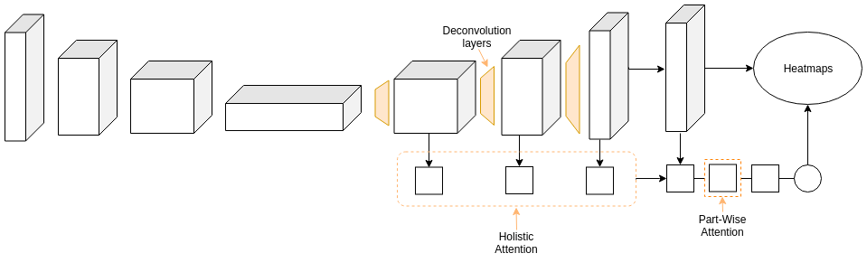

# Pose Estimation using Attention based mechanisms
Pose Estimation
<p align="center">

</p>

## Dependencies
* [TensorFlow](https://www.tensorflow.org/)
* [CUDA](https://developer.nvidia.com/cuda-downloads)
* [cuDNN](https://developer.nvidia.com/cudnn)
* [Anaconda](https://www.anaconda.com/download/)
* [COCO API](https://github.com/cocodataset/cocoapi)

## Directory

### Root
The `${POSE_ROOT}` is described as below.
```
${POSE_ROOT}
|-- data
|-- lib
|-- main
|-- tool
`-- output
```
* `data` contains data loading codes and soft links to images and annotations directories.
* `lib` contains kernel codes for 2d multi-person pose estimation system.
* `main` contains high-level codes for training or testing the network.
* `tool` contains dataset converter. I set MS COCO as reference format and provide mpii2coco and posetrack2coco converting code.
* `output` contains log, trained models, visualized outputs, and test result.

### Data
You need to follow directory structure of the `data` as below.
```
${POSE_ROOT}
|-- data
|-- |-- COCO
|   `-- |-- dets
|       |   |-- human_detection.json
|       |-- annotations
|       |   |-- person_keypoints_train2017.json
|       |   |-- person_keypoints_val2017.json
|       |   `-- image_info_test-dev2017.json
|       `-- images
|           |-- train2017/
|           |-- val2017/
|           `-- test2017/
`-- |-- imagenet_weights
|       |-- resnet_v1_50.ckpt
```

### Output
You need to follow the directory structure of the `output` folder as below.
```
${POSE_ROOT}
|-- output
|-- |-- log
|-- |-- model_dump
|-- |-- result
`-- |-- vis

* Creating `output` folder as soft link form is recommended instead of folder form because it would take large storage capacity.
* `log` folder contains training log file.
* `model_dump` folder contains saved checkpoints for each epoch.
* `result` folder contains final estimation files generated in the testing stage.
* `vis` folder contains visualized results.
* You can change default directory structure of `output` by modifying `main/config.py`.

## Running TF-SimpleHumanPose
### Start
* Run `pip install -r requirement.txt` to install required modules.
* Run `cd ${POSE_ROOT}/lib` and `make` to build NMS modules.
* In the `main/config.py`, you can change settings of the model including dataset to use, network backbone, and input size and so on.

### Train
In the `main` folder, run
```bash
python train.py --gpu 0-1
```
to train the network on the GPU 0,1. 

If you want to continue experiment, run 
```bash
python train.py --gpu 0-1 --continue
```
`--gpu 0,1` can be used instead of `--gpu 0-1`.

### Test
Place trained model at the `output/model_dump/$DATASET/` and human detection result (`human_detection.json`) to `data/$DATASET/dets/`.

In the `main` folder, run 
```bash
python test.py --gpu 0-1 --test_epoch 140
```
to test the network on the GPU 0,1 with 140th epoch trained model. `--gpu 0,1` can be used instead of `--gpu 0-1`.